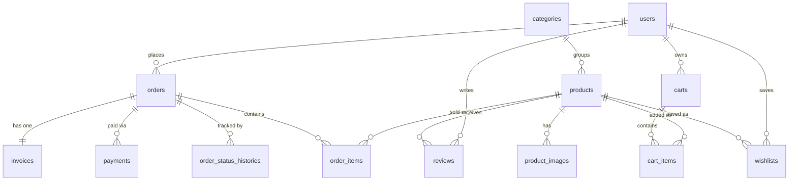

# ShopEase — Database Design

|                  |                                                                      |
| ---------------- | -------------------------------------------------------------------- |
| **Product**      | ShopEase                                                             |
| **Type**         | E-commerce Web Application                                           |
| **Stack**        | Laravel 13 · Vue 3 · Inertia.js · Tailwind · **Laravel Starter Kit** |
| **Database**     | MySQL 8 (InnoDB, `utf8mb4`)                                          |
| **Currency**     | Bangladeshi Taka (৳ / BDT)                                           |
| **Version**      | 1.0                                                                  |
| **Date**         | 2026-06-21                                                           |
| **Related Docs** | `PRD.md`, `REQUIREMENT_ANALYSIS.md`, `DESIGN_GUIDELINES.md`          |

> This document is the single source of truth for the ShopEase schema. It covers every table, column, datatype, key, index, relationship, and enum, derived from the PRD, the Requirement Analysis, and the storefront UI prototypes (`/design`).

---

## 1. Conventions

| Area | Convention |
|------|-----------|
| **Engine / charset** | InnoDB, `utf8mb4` / `utf8mb4_unicode_ci` |
| **Primary keys** | `id` — `bigIncrements` (BIGINT UNSIGNED, auto-increment) |
| **Foreign keys** | `*_id` — `foreignId` (BIGINT UNSIGNED) with explicit `ON DELETE` behavior |
| **Timestamps** | `created_at`, `updated_at` (nullable `TIMESTAMP`) on every domain table |
| **Soft deletes** | `deleted_at` on tables that must preserve references (categories, products) |
| **Money** | `DECIMAL(10,2)` for line/unit values, `DECIMAL(12,2)` for order/invoice totals. Stored in BDT; formatted with ৳ + thousands separators in the UI |
| **Booleans** | `boolean` (TINYINT(1)), default specified per column |
| **Enums** | MySQL `ENUM` for small, fixed, app-controlled sets (status, payment) |
| **Slugs** | unique, URL-safe, used for SEO routes (`/product/{slug}`, category filter) |
| **Naming** | tables plural snake_case; columns snake_case (Laravel convention) |

**Datatype column** below uses the **Laravel migration type**; the **Notes** column lists the SQL specifics, constraints, and indexes.

---

## 2. Entity Relationship Overview

**Cardinality summary**
- A **Category** has many **Products**; a **Product** belongs to one **Category**.
- A **Product** has many **ProductImages**.
- An **Order** has many **OrderItems**, exactly one **Invoice**, many **Payments** (attempts), and many **OrderStatusHistories**.
- A **User** (customer) has many **Orders**, **Reviews**, **Wishlists**, and one active **Cart**.
- A **Product** has many **Reviews**.

---

## 3. Framework & System Tables (Laravel Starter Kit)

These ship with Laravel / the starter kit. Kept as-is so the starter kit's auth, queue, and session features work out of the box. Shown for completeness.

### 3.1 `users`  *(Laravel default + 2 additive columns)*

> The user requested the `users` table stay aligned with Laravel. All Laravel default columns are unchanged; only `role` and `phone` are **added** (both safe/non-breaking). For richer RBAC, `spatie/laravel-permission` can replace the `role` column later without touching defaults.

| Column | Type | Notes |
|--------|------|-------|
| `id` | `bigIncrements` | PK — *Laravel default* |
| `name` | `string(255)` | *Laravel default* |
| `email` | `string(255)` | UNIQUE — *Laravel default* |
| `email_verified_at` | `timestamp` nullable | *Laravel default* |
| `password` | `string(255)` | bcrypt/argon hash — *Laravel default* |
| `remember_token` | `string(100)` nullable | *Laravel default* |
| `created_at` | `timestamp` nullable | *Laravel default* |
| `updated_at` | `timestamp` nullable | *Laravel default* |
| `role` | `enum('admin','customer')` | **Added.** default `'customer'`; gates admin panel access (PRD §5.8). INDEX |
| `phone` | `string(20)` nullable | **Added.** optional contact / order autofill |

### 3.2 `password_reset_tokens` *(default)*
| Column | Type | Notes |
|--------|------|-------|
| `email` | `string(255)` | PK |
| `token` | `string(255)` | |
| `created_at` | `timestamp` nullable | |

### 3.3 `sessions` *(default — used for guest cart persistence)*
| Column | Type | Notes |
|--------|------|-------|
| `id` | `string` | PK |
| `user_id` | `foreignId` nullable | INDEX |
| `ip_address` | `string(45)` nullable | |
| `user_agent` | `text` nullable | |
| `payload` | `longText` | |
| `last_activity` | `integer` | INDEX |

### 3.4 Queue & cache tables *(default — required for queued emails, PRD §5.16)*
- **`jobs`** — `id`, `queue` (INDEX), `payload` (longText), `attempts` (tinyint), `reserved_at` (int nullable), `available_at` (int), `created_at` (int).
- **`job_batches`** — `id` (string PK), `name`, `total_jobs`, `pending_jobs`, `failed_jobs`, `failed_job_ids` (longText), `options` (mediumText nullable), `cancelled_at`, `created_at`, `finished_at`.
- **`failed_jobs`** — `id`, `uuid` (UNIQUE), `connection` (text), `queue` (text), `payload` (longText), `exception` (longText), `failed_at` (timestamp default now).
- **`cache`** / **`cache_locks`** — key/value store tables (default).
- **`migrations`**, **`personal_access_tokens`** *(if Sanctum)* — default.

---

## 4. Application Tables

### 4.1 `hero_slides`  *(PRD §5.9 — Hero Management)*
Admin-managed home carousel. Storefront shows image only; heading/subtext/CTA optional.

| Column                      | Type                   | Notes                                   |
| --------------------------- | ---------------------- | --------------------------------------- |
| `id`                        | `bigIncrements`        | PK                                      |
| `image`                     | `string(255)`          | image path on public disk. **Required** |
| `link`                      | `string(255)` nullable | CTA destination URL                     |
| `cta_label`                 | `string(100)` nullable | CTA button text                         |
| `sort_order`                | `unsignedInteger`      | default `0` — manual ordering           |
| `is_active`                 | `boolean`              | default `true`                          |
| `created_at` / `updated_at` | `timestamps`           |                                         |

**Indexes:** composite `(is_active, sort_order)` for the active, ordered storefront query.

---

### 4.2 `categories`  *(PRD §5.10 — Category Management)*
| Column                      | Type                   | Notes                                               |
| --------------------------- | ---------------------- | --------------------------------------------------- |
| `id`                        | `bigIncrements`        | PK                                                  |
| `name`                      | `string(150)`          |                                                     |
| `slug`                      | `string(170)`          | **UNIQUE** — used for shop filter / SEO             |
| `image`                     | `string(255)` nullable | category tile image (design uses image, no icon)    |
| `description`               | `text` nullable        |                                                     |
| `sort_order`                | `unsignedInteger`      | default `0`                                         |
| `is_active`                 | `boolean`              | default `true` — deactivating hides from storefront |
| `created_at` / `updated_at` | `timestamps`           |                                                     |
| `deleted_at`                | `softDeletes`          | preserve product references (RA §5.4)               |

**Indexes:** UNIQUE `slug`; INDEX `(is_active, sort_order)`.

---

### 4.3 `products`  *(PRD §5.11 — Product Management)*
No quantity tracking — only a stock **status** badge (business rule).

| Column                      | Type                           | Notes                                                                     |
| --------------------------- | ------------------------------ | ------------------------------------------------------------------------- |
| `id`                        | `bigIncrements`                | PK                                                                        |
| `category_id`               | `foreignId` → `categories.id`  | `ON DELETE RESTRICT`. INDEX                                               |
| `name`                      | `string(200)`                  |                                                                           |
| `slug`                      | `string(220)`                  | **UNIQUE** — route `/product/{slug}`                                      |
| `description`               | `longText` nullable            | full description (details page)                                           |
| `price`                     | `decimal(10,2)`                | current selling price (৳)                                                 |
| `compare_at_price`          | `decimal(10,2)` nullable       | original/strikethrough price for "Save %" (design cards)                  |
| `stock_status`              | `enum('in_stock','stock_out')` | default `'in_stock'`                                                      |
| `is_best_seller`            | `boolean`                      | default `false` (Best Selling section)                                    |
| `is_featured`               | `boolean`                      | default `false`                                                           |
| `is_active`                 | `boolean`                      | default `true`                                                            |
| `sold_count`                | `unsignedInteger`              | default `0` — denormalized best-seller ranking cache (RA business rule 6) |
| `created_at` / `updated_at` | `timestamps`                   | `created_at` drives **New Collection** ordering                           |
| `deleted_at`                | `softDeletes`                  | order_items keep a snapshot, so deletion is safe                          |
| short_description           | string                         |                                                                           |

**Indexes:** UNIQUE `slug`; INDEX `category_id`; composite `(is_active, stock_status)`; INDEX `is_best_seller`, `is_featured`, `created_at`.

---

### 4.4 `product_images`  *(PRD §5.11 — multiple images / gallery)*
| Column                      | Type                        | Notes                                     |
| --------------------------- | --------------------------- | ----------------------------------------- |
| `id`                        | `bigIncrements`             | PK                                        |
| `product_id`                | `foreignId` → `products.id` | `ON DELETE CASCADE`. INDEX                |
| `image_path`                | `string(255)`               | public disk path                          |
| `alt_text`                  | `string(255)` nullable      | a11y / SEO                                |
| `is_primary`                | `boolean`                   | default `false` — main gallery/card image |
| `sort_order`                | `unsignedInteger`           | default `0` — thumbnail order             |
| `created_at` / `updated_at` | `timestamps`                |                                           |

**Indexes:** INDEX `product_id`; composite `(product_id, is_primary)`.

---

### 4.5 `carts`  *(PRD §5.4 — persist cart · Should)*
One open cart per user (and/or per guest session). Enables the slide-in cart drawer + cart page to persist.

| Column                      | Type                              | Notes                                         |
| --------------------------- | --------------------------------- | --------------------------------------------- |
| `id`                        | `bigIncrements`                   | PK                                            |
| `user_id`                   | `foreignId` nullable → `users.id` | `ON DELETE CASCADE`. INDEX. null for guests   |
| `session_id`                | `string(255)` nullable            | guest cart key (matches `sessions.id`). INDEX |
| `created_at` / `updated_at` | `timestamps`                      |                                               |

### 4.6 `cart_items`
| Column                      | Type                        | Notes                      |
| --------------------------- | --------------------------- | -------------------------- |
| `id`                        | `bigIncrements`             | PK                         |
| `cart_id`                   | `foreignId` → `carts.id`    | `ON DELETE CASCADE`. INDEX |
| `product_id`                | `foreignId` → `products.id` | `ON DELETE CASCADE`        |
| `quantity`                  | `unsignedInteger`           | default `1`, min 1         |
| `created_at` / `updated_at` | `timestamps`                |                            |

**Indexes:** UNIQUE `(cart_id, product_id)` — one row per product per cart (qty increments).

---

### 4.7 `orders`  *(PRD §5.5 / §5.12)*
Captures shipping details, totals, payment, and lifecycle status. Supports guest checkout (`user_id` nullable).

| Column                      | Type                                                             | Notes                                            |
| --------------------------- | ---------------------------------------------------------------- | ------------------------------------------------ |
| `id`                        | `bigIncrements`                                                  | PK                                               |
| `order_number`              | `string(32)`                                                     | **UNIQUE** — human-facing, e.g. `SE-2026-000123` |
| `user_id`                   | `foreignId` nullable → `users.id`                                | `ON DELETE SET NULL`. INDEX. null = guest        |
| `customer_name`             | `string(150)`                                                    |                                                  |
| `phone`                     | `string(20)`                                                     | INDEX — admin search (RA §5.6)                   |
| `email`                     | `string(255)`                                                    | confirmation email recipient                     |
| `district`                  | `string(100)`                                                    | drives delivery charge (inside/outside Dhaka)    |
| `area`                      | `string(150)`                                                    | area / thana                                     |
| `address`                   | `text`                                                           | full address line                                |
| `notes`                     | `text` nullable                                                  | optional delivery instructions                   |
| `subtotal`                  | `decimal(12,2)`                                                  | sum of line totals                               |
| `delivery_charge`           | `decimal(10,2)`                                                  | default `0` — from `settings`                    |
| `total`                     | `decimal(12,2)`                                                  | `subtotal + delivery_charge`                     |
| `payment_method`            | `enum('cod','sslcommerz')`                                       |                                                  |
| `payment_status`            | `enum('pending','paid','failed','cancelled')`                    | default `'pending'`                              |
| `status`                    | `enum('pending','processing','shipped','delivered','cancelled')` | default `'pending'`                              |
| `placed_at`                 | `timestamp` nullable                                             | order placement time                             |
| `created_at` / `updated_at` | `timestamps`                                                     |                                                  |

**Indexes:** UNIQUE `order_number`; INDEX `user_id`, `phone`, `status`, `payment_status`, `created_at`.

---

### 4.8 `order_items`  *(line-item snapshots)*
Stores name/price **at time of purchase** so historical orders/invoices stay accurate even if the product changes.

| Column                      | Type                                 | Notes                                                   |
| --------------------------- | ------------------------------------ | ------------------------------------------------------- |
| `id`                        | `bigIncrements`                      | PK                                                      |
| `order_id`                  | `foreignId` → `orders.id`            | `ON DELETE CASCADE`. INDEX                              |
| `product_id`                | `foreignId` nullable → `products.id` | `ON DELETE SET NULL` (keep snapshot if product removed) |
| `product_name`              | `string(200)`                        | snapshot                                                |
| `unit_price`                | `decimal(10,2)`                      | snapshot                                                |
| `quantity`                  | `unsignedInteger`                    |                                                         |
| `line_total`                | `decimal(12,2)`                      | `unit_price × quantity`                                 |
| `created_at` / `updated_at` | `timestamps`                         |                                                         |

**Indexes:** INDEX `order_id`, `product_id`.

---

### 4.10 `payments`  *(SSLCommerz transactions — idempotent callbacks, PRD §5.5 / §10)*
Separate from `orders` so each gateway attempt is recorded; unique gateway ids guarantee idempotency (no duplicate confirmations on callback retries).

| Column                      | Type                                               | Notes                                                   |
| --------------------------- | -------------------------------------------------- | ------------------------------------------------------- |
| `id`                        | `bigIncrements`                                    | PK                                                      |
| `order_id`                  | `foreignId` → `orders.id`                          | `ON DELETE CASCADE`. INDEX                              |
| `gateway`                   | `string(30)`                                       | default `'sslcommerz'`                                  |
| `transaction_id`            | `string(100)` nullable                             | **UNIQUE** — our `tran_id` sent to gateway              |
| `val_id`                    | `string(100)` nullable                             | **UNIQUE** — SSLCommerz validation id (idempotency key) |
| `amount`                    | `decimal(12,2)`                                    |                                                         |
| `currency`                  | `string(3)`                                        | default `'BDT'`                                         |
| `status`                    | `enum('initiated','success','failed','cancelled')` | default `'initiated'`                                   |
| `card_type`                 | `string(50)` nullable                              | e.g. VISA / bKash / Nagad                               |
| `bank_tran_id`              | `string(100)` nullable                             | gateway bank ref                                        |
| `store_amount`              | `decimal(12,2)` nullable                           | net after gateway fee                                   |
| `raw_response`              | `json` nullable                                    | full gateway payload (audit)                            |
| `paid_at`                   | `timestamp` nullable                               | success time                                            |
| `created_at` / `updated_at` | `timestamps`                                       |                                                         |

**Indexes:** INDEX `order_id`, `status`; UNIQUE `transaction_id`, UNIQUE `val_id`.

---

### 4.11 `order_status_histories`  *(lifecycle audit → status emails, PRD §5.12)*
| Column | Type | Notes |
|--------|------|-------|
| `id` | `bigIncrements` | PK |
| `order_id` | `foreignId` → `orders.id` | `ON DELETE CASCADE`. INDEX |
| `status` | `enum('pending','processing','shipped','delivered','cancelled')` | new status applied |
| `note` | `string(255)` nullable | optional admin note |
| `changed_by` | `foreignId` nullable → `users.id` | `ON DELETE SET NULL` — acting admin |
| `created_at` | `timestamp` | when the change happened |

---

### 4.12 `reviews`  *(PRD §5.6 / §5.14 — ratings + moderation)*
| Column                      | Type                               | Notes                                                       |
| --------------------------- | ---------------------------------- | ----------------------------------------------------------- |
| `id`                        | `bigIncrements`                    | PK                                                          |
| `product_id`                | `foreignId` → `products.id`        | `ON DELETE CASCADE`. INDEX                                  |
| `user_id`                   | `foreignId` → `users.id`           | `ON DELETE CASCADE` — reviews require an account            |
| `order_id`                  | `foreignId` nullable → `orders.id` | `ON DELETE SET NULL` — links a verified purchase (optional) |
| `rating`                    | `unsignedTinyInteger`              | 1–5 (validate range)                                        |
| `comment`                   | `text` nullable                    |                                                             |
| `is_approved`               | `boolean`                          | default `false` — hidden until admin approves               |
| `approved_at`               | `timestamp` nullable               |                                                             |
| `created_at` / `updated_at` | `timestamps`                       |                                                             |

**Indexes:** INDEX `product_id`, `user_id`; composite `(product_id, is_approved)` (public list query); UNIQUE `(user_id, product_id)` — one review per product per customer.

### 5.1 `wishlists`
| Column | Type | Notes |
|--------|------|-------|
| `id` | `bigIncrements` | PK |
| `user_id` | `foreignId` → `users.id` | `ON DELETE CASCADE`. INDEX |
| `product_id` | `foreignId` → `products.id` | `ON DELETE CASCADE` |
| `created_at` / `updated_at` | `timestamps` | |

**Indexes:** UNIQUE `(user_id, product_id)`.

---

## 6. Enumerations Reference

| Table.Column                    | Values                                                       |
| ------------------------------- | ------------------------------------------------------------ |
| `users.role`                    | `admin`, `customer`                                          |
| `products.stock_status`         | `in_stock`, `stock_out`                                      |
| `orders.payment_method`         | `cod`, `sslcommerz`                                          |
| `orders.payment_status`         | `pending`, `paid`, `failed`, `cancelled`                     |
| `orders.status`                 | `pending`, `processing`, `shipped`, `delivered`, `cancelled` |
| `payments.status`               | `initiated`, `success`, `failed`, `cancelled`                |
| `order_status_histories.status` | same as `orders.status`                                      |

---

## 7. Foreign Key & Delete Behavior Summary

| Child → Parent | On Delete | Rationale |
|----------------|-----------|-----------|
| `products.category_id` → `categories` | RESTRICT | categories are soft-deleted/deactivated, never hard-deleted while in use |
| `product_images.product_id` → `products` | CASCADE | images belong to the product |
| `cart_items.cart_id` → `carts` | CASCADE | |
| `cart_items.product_id` → `products` | CASCADE | |
| `orders.user_id` → `users` | SET NULL | keep order history if a user is removed; supports guests |
| `order_items.order_id` → `orders` | CASCADE | |
| `order_items.product_id` → `products` | SET NULL | snapshot retained in row |
| `invoices.order_id` → `orders` | CASCADE | |
| `payments.order_id` → `orders` | CASCADE | |
| `order_status_histories.order_id` → `orders` | CASCADE | |
| `order_status_histories.changed_by` → `users` | SET NULL | |
| `reviews.product_id` → `products` | CASCADE | |
| `reviews.user_id` → `users` | CASCADE | |
| `reviews.order_id` → `orders` | SET NULL | |
| `wishlists.*` | CASCADE | |

---

## 8. Recommended Migration Order

To satisfy foreign-key dependencies:

1. Framework defaults — `users` (+`role`,`phone`), `password_reset_tokens`, `sessions`, `cache`, `jobs`, `job_batches`, `failed_jobs`
2. `hero_slides`
3. `categories`
4. `products`
5. `product_images`
6. `carts` → `cart_items`
7. `orders`
8. `order_items`
9. `invoices`
10. `payments`
11. `order_status_histories`
12. `reviews`
13. `wishlists` *(Phase 3)*

---

## 9. Derived / Computed Values (not stored, unless cached)

| Value | Source |
|-------|--------|
| Product **average rating** & **review count** | aggregate of approved `reviews` per product (cache optional) |
| **New Collection** | `products` ordered by `created_at` DESC where `is_active` |
| **Best Selling** | `products.is_best_seller` OR ranked by `sold_count` / SUM(`order_items.quantity`) |
| Cart **subtotal / line totals** | computed from `cart_items` × `products.price` |
| Order **subtotal / total** | stored as snapshots on `orders` at placement |
| Dashboard widgets / **sales reports** | aggregates over `orders`, `order_items`, `payments` by date range |

